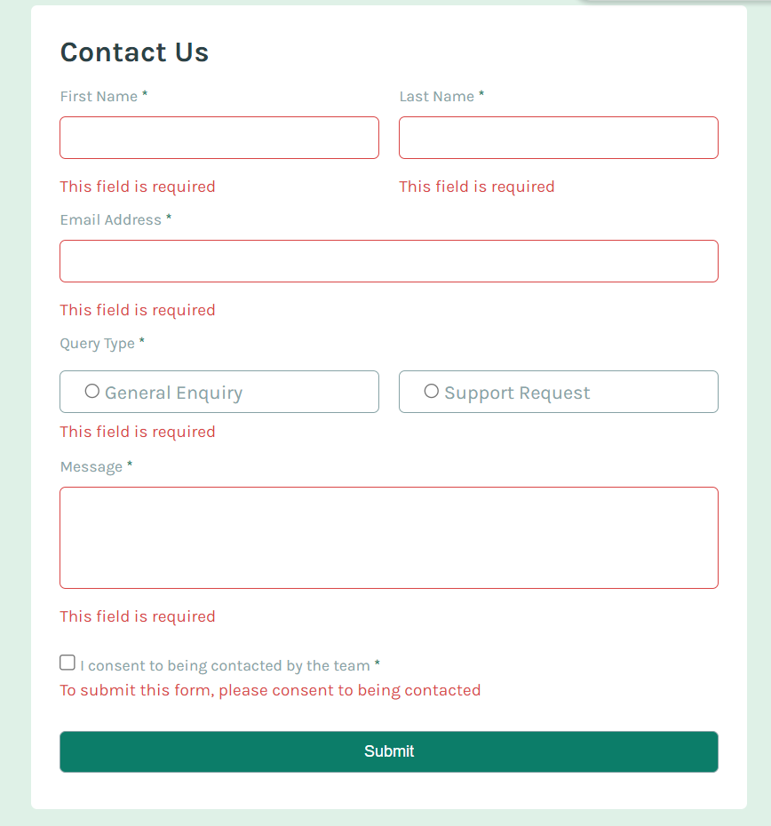
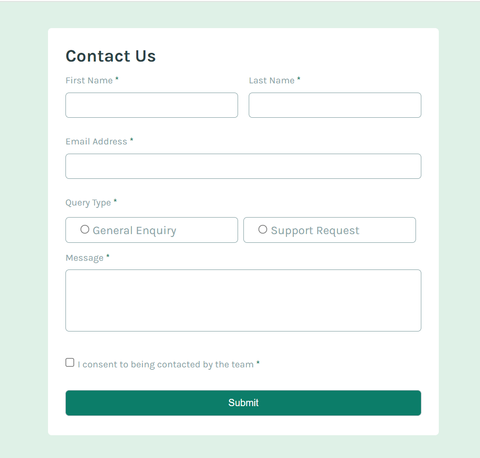

# Frontend Mentor - Contact Form Solution

This is a solution to the **Contact Form challenge** on [Frontend Mentor](https://www.frontendmentor.io/challenges). Frontend Mentor challenges help you improve your coding skills by building realistic projects.

---

## 📑 Table of Contents

- [Overview](#overview)
- [The Challenge](#the-challenge)
- [Screenshots](#screenshots)
- [Links](#links)
- [My Process](#my-process)
- [Built With](#built-with)
- [What I Learned](#what-i-learned)
- [Continued Development](#continued-development)
- [Useful Resources](#useful-resources)
- [Author](#author)
- [Acknowledgments](#acknowledgments)

---

## 🧾 Overview

This project is a responsive, accessible contact form built with semantic HTML, modern CSS (Flexbox & Grid), and vanilla JavaScript. It validates input on the client side and provides user feedback using visual cues and screen reader-friendly messages.

---

## 🏁 The Challenge

Users should be able to:

- ✅ Complete the form and see a success toast message upon submission
- ✅ Receive validation messages when:
  - A required field is empty
  - The email address is not formatted correctly
- ✅ Use only their keyboard to fill and submit the form
- ✅ Have inputs, error messages, and success messages announced via screen reader
- ✅ See optimal layouts on different screen sizes (mobile/desktop)
- ✅ Experience clear hover and focus states on interactive elements

---

## 🖼️ Screenshots

### ❌ Validation Error States  

### 🖥️ Desktop View  

---

## 🔗 Links

- **Solution URL:** [GitHub Repository](https://github.com/yaoamegandjin/web-dev-challenges/tree/main/contact-form-main)
- **Live Site:** [https://contact-form-main-ya.netlify.app](https://contact-form-main-ya.netlify.app)

---

## 🛠️ My Process

1. Start with semantic HTML structure.
2. Apply CSS using mobile-first approach.
3. Add layout styling with Flexbox and CSS Grid.
4. Implement JavaScript for form validation and success/error feedback.
5. Test responsiveness and interaction states.

---

## 🧱 Built With

- Semantic **HTML5**
- **CSS** (Flexbox, Grid)
- **JavaScript** (Vanilla)
- Mobile-first responsive design

---

## 📚 What I Learned

> “The most important thing I learned from this challenge is how to do **form validation using JavaScript**.”

Other takeaways:

- Implementing **real-time form feedback**
- Structuring responsive layouts using modern CSS tools

---

## 🧩 Continued Development

I want to improve:

- **Responsiveness** – my current design works, but it could be more elegant.
- **CSS styling** – it's functional, but needs refinement for scalability.
- **JavaScript** – it often feels overwhelming due to the number of ways to solve a single problem. Continued practice will help my confidence.

---

## 📖 Useful Resources

- **[MDN Web Docs](https://developer.mozilla.org/)** – invaluable for JavaScript concepts I didn’t initially understand.
- **[CSS Selectors Cheatsheet](https://frontend30.com/css-selectors-cheatsheet/)** – a must-have reference.
- **[Form Validation Tutorial by Tracy](https://dev.to/tracydev)** – the most helpful resource I found during this project.
---

## 👤 Author

- Frontend Mentor – [@yaoamegandjin](https://www.frontendmentor.io/profile/yaoamegandjin)
- GitHub – [@yaoamegandjin](https://github.com/yaoamegandjin)

---

## 🙏 Acknowledgments

Big thanks to **Tracy** for his amazing [form validation tutorial on DEV](https://dev.to/tracydev). It made a huge difference in how I approached and understood the logic for validating forms effectively.

---
