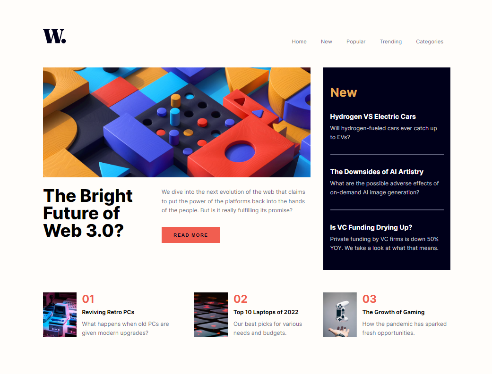

# Frontend Mentor - News Homepage Solution

This is a solution to the [News homepage challenge on Frontend Mentor](https://www.frontendmentor.io/challenges/news-homepage-H6SWTa1MFl). This project was a great opportunity to practice **CSS Grid**, **responsive layouts**, and clean UI design using **React**.

---

## 📚 Table of Contents

- [Overview](#overview)
- [The Challenge](#the-challenge)
- [Screenshot](#screenshot)
- [Links](#links)
- [My Process](#my-process)
  - [Built With](#built-with)
  - [What I Learned](#what-i-learned)
  - [Continued Development](#continued-development)
  - [Useful Resources](#useful-resources)
- [Author](#author)
- [Acknowledgments](#acknowledgments)

---

## 📖 Overview

This news homepage is designed to be visually engaging and responsive across screen sizes. The layout relies heavily on **CSS Grid**, and interactive elements include hover and focus states to enhance usability.

---

## 🧩 The Challenge

Users should be able to:

- ✅ View the optimal layout for the interface on all device sizes
- ✅ See clear **hover** and **focus** states for all interactive elements

---

## 🖼 Screenshot



---

## 🔗 Links

- **Solution URL:** [https://github.com/yaoamegandjin/web-dev-challenges/tree/main/news-homepage-main](https://github.com/yaoamegandjin/web-dev-challenges/tree/main/news-homepage-main)
- **Live Site URL:** [https://news-homepage-main-ya.netlify.app](https://news-homepage-main-ya.netlify.app)

---

## ⚙️ My Process

### 🧱 Built With

- Semantic **HTML5**
- **CSS Grid** and **Flexbox**
- **Mobile-first** responsive design
- **React** (for component-based structure)

---

### 🌱 What I Learned

This was my **first time using CSS Grid**, and it made layout management much easier compared to trying to force it with only Flexbox.

Here's a snippet of my layout using Grid:

```css
.grid-container {
  max-width: 1150px;
  margin: 0 auto;
  display: grid;
  grid-template-columns: repeat(3, 1fr);
  grid-template-rows: repeat(17, 1fr);
  column-gap: 2.3em;
}

.grid-container > nav {
  grid-column: 1 / span 3;
  grid-row: 2;
}

.grid-container > section:nth-child(2) {
  grid-column: 1 / span 2;
  grid-row: 4 / span 9;
}

.grid-container > section:nth-child(3) {
  grid-column: 3;
  grid-row: 4 / span 9;
}

.grid-container > section:nth-child(4) {
  grid-column: 1 / span 3;
  grid-row: 14 / span 2;
}
```
### 🧩 Continued Development

Some areas I'd like to improve and explore further:

- Making the layout even more **scalable** and **componentized** using React.
- Exploring **CSS Grid Template Areas** for cleaner readability.
- Implementing **theme toggling** (light/dark mode).
- Improving accessibility for keyboard and screen reader users.

---

### 📌 Useful Resources

- [🔥 CSS Grid Basics – Kevin Powell](https://www.youtube.com/watch?v=xPuYbmmPdEM)  
  Great introduction to the core principles of CSS Grid. Helped me understand layout structure more clearly and apply it effectively.

- [🔧 React Responsive Navbar Tutorial – Web Dev Simplified](https://www.youtube.com/watch?v=23BHwAFIZmk)  
  Helped me build a flexible, mobile-friendly navbar using React.

- [📘 MDN Web Docs – CSS Grid Layout](https://developer.mozilla.org/en-US/docs/Web/CSS/CSS_grid_layout)  
  Comprehensive documentation and examples for working with CSS Grid.

- [🧠 CSS Tricks – A Complete Guide to Grid](https://css-tricks.com/snippets/css/complete-guide-grid/)  
  A cheat sheet and deep dive into all things CSS Grid. Super useful reference.

- [🔍 Frontend Mentor – News Homepage Challenge](https://www.frontendmentor.io/challenges/news-homepage-H6SWTa1MFl)  
  The original challenge prompt that guided this project.
  
---

## 👤 Author

- Frontend Mentor – [@yaoamegandjin](https://www.frontendmentor.io/profile/yaoamegandjin)
- GitHub – [@yaoamegandjin](https://github.com/yaoamegandjin)

## 🙏 Acknowledgments

Special thanks to the Frontend Mentor community for helpful feedback and to all the creators who share their work and tutorials online — they make learning and improving as a developer much easier and more enjoyable.
