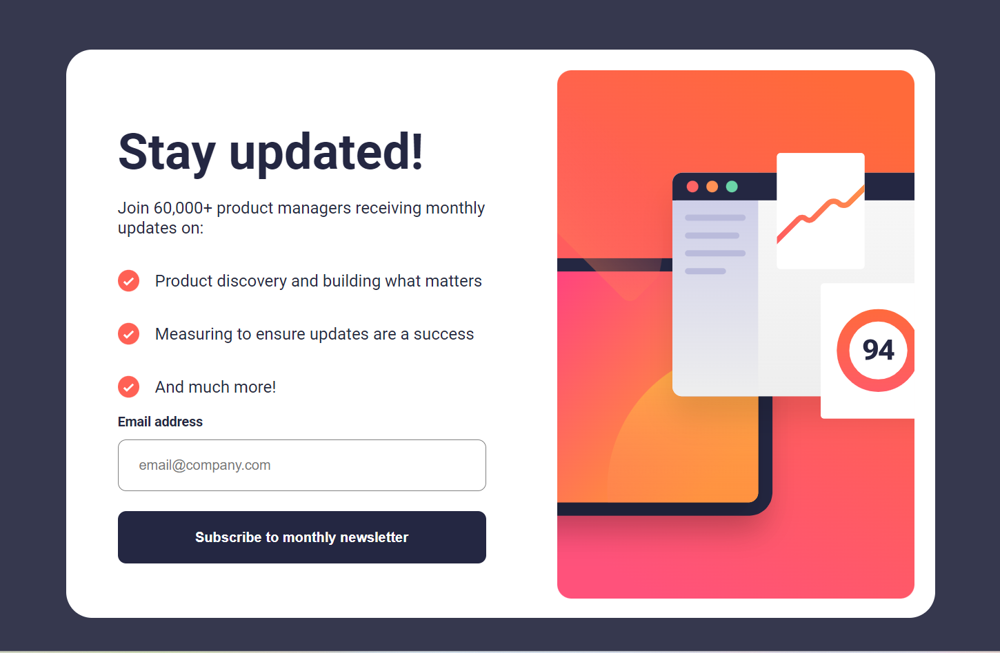

# Frontend Mentor - Newsletter Sign-up Form with Success Message Solution

This is a solution to the [Newsletter sign-up form with success message challenge on Frontend Mentor](https://www.frontendmentor.io/challenges/newsletter-signup-form-with-success-message-3FC1AZbNrv). Frontend Mentor challenges help you improve your coding skills by building realistic projects.

---

## 📋 Table of Contents

- [Overview](#overview)
  - [The Challenge](#the-challenge)
  - [Screenshot](#screenshot)
  - [Links](#links)
- [My Process](#my-process)
  - [Built With](#built-with)
  - [What I Learned](#what-i-learned)
  - [Useful Resources](#useful-resources)
- [Author](#author)
- [Acknowledgments](#acknowledgments)

---

## 🧾 Overview

### ✅ The Challenge

Users should be able to:

- Add their email and submit the form
- See a success message with their email after submitting
- See validation messages when:
  - The input is empty
  - The email format is invalid
- View the layout optimized for their device (mobile, tablet, desktop)
- Experience clear hover and focus states for all interactive elements

### 🖼️ Screenshot



---

### 🔗 Links

- **Solution URL:** [Frontend Mentor](https://www.frontendmentor.io/solutions/responsive-newsletter-sign-up-form-using-html-css-and-javascript-xk4FzoXAPh)
- **Live Site URL:** [Live Demo](https://newsletter-sign-up-ya.netlify.app)

---

## 🛠️ My Process

### 🔧 Built With

- Semantic **HTML5**
- **Flexbox** & **CSS Grid**
- **JavaScript** (Vanilla)
- **Mobile-first** responsive design

---

### 📚 What I Learned

I learned how to use the `<picture>` element to conditionally load images based on screen size. Here's a code snippet:

```html
<picture>
  <source media="(max-width: 846px)" srcset="assets/images/illustration-sign-up-mobile.svg" />
  
</picture>
```
This gave me more control than traditional CSS media queries when swapping image assets for responsiveness

---

### 📌 Useful Resources

- [💡 Resolution Switching with `<srcset>`](https://blog.prototypr.io/resolution-switching-to-viewport-based-image-easily-with-srcset-bc779881b80a)  
  This article helped me understand how to use the `<picture>` element and `<srcset>` attribute to serve different images based on screen size. It was more reliable than media queries in this case.

- [🎨 CSS Gradient Generator](https://mycolor.space/gradient?ori=to+right&hex=%23FA6057&hex2=%23F95776&sub=1)  
  A simple and effective tool I used to generate the background color gradient for the form.

---

## 👤 Author

- Frontend Mentor — [@yaoamegandjin](https://www.frontendmentor.io/profile/yaoamegandjin)
- GitHub – [@yaoamegandjin](https://github.com/yaoamegandjin)

---

## 🙏 Acknowledgments

Special thanks to the Frontend Mentor community for helpful feedback and to all the creators who share their work and tutorials online — they make learning and improving as a developer much easier and more enjoyable.
