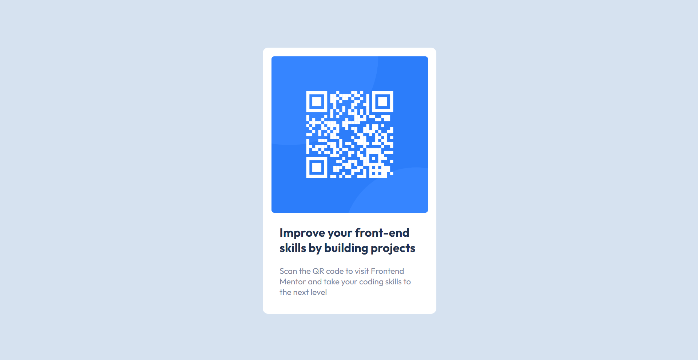

# Frontend Mentor - QR code component solution

This is a solution to the [QR code component challenge on Frontend Mentor](https://www.frontendmentor.io/challenges/qr-code-component-iux_sIO_H). Frontend Mentor challenges help you improve your coding skills by building realistic projects.

---

## 📑 Table of Contents

- [Overview](#overview)
  - [Screenshot](#screenshot)
  - [Links](#links)
- [My Process](#my-process)
  - [Built With](#built-with)
  - [What I Learned](#what-i-learned)
  - [Continued Development](#continued-development)
  - [Useful Resources](#useful-resources)
- [Author](#author)
- [Acknowledgments](#acknowledgments)

---

## 📌 Overview

A simple, static QR code component challenge ideal for beginners looking to practice HTML and CSS fundamentals.

### 📷 Screenshot

### 🔗 Links

- 💡 [Solution URL](https://www.frontendmentor.io/solutions/responsive-qr-code-component-using-html-css-and-flexbox-p3Vm5FogQH)
- 🌐 [Live Site URL](https://qr-code-component-ya.netlify.app)

---

## 🔧 My Process

### 🛠️ Built With

- Semantic **HTML5** markup
- **CSS custom properties**
- **Flexbox**
- **CSS Grid**

### 🧠 What I Learned

> Practice or you will lose your skills.  
> This is my first frontend design challenge in months. It took me a bit to refresh my memory on the fundamentals of HTML and CSS, but it was a great reminder of how important consistency is in coding.

### 🔄 Continued Development

I plan to continue improving my responsive design skills. Although this component was static, I want to practice adapting layouts for different screen sizes more efficiently.

### 📚 Useful Resources

- [HTML Semantics Cheat Sheet – Learn the Web](https://learntheweb.courses) – Helped me revisit key semantic HTML tags and their usage.
- [CSS Selectors Cheatsheet – Frontend30](https://frontend30.com/css-selectors-cheatsheet/) – A handy reference that refreshed my memory on different selectors and their behaviors.

---

## 👤 Author

- Frontend Mentor – [@yaoamegandjin](https://www.frontendmentor.io/profile/yaoamegandjin)
- GitHub – [@yaoamegandjin](https://github.com/yaoamegandjin)

## 🙏 Acknowledgments

Special thanks to the Frontend Mentor community for helpful feedback and to all the creators who share their work and tutorials online — they make learning and improving as a developer much easier and more enjoyable.
