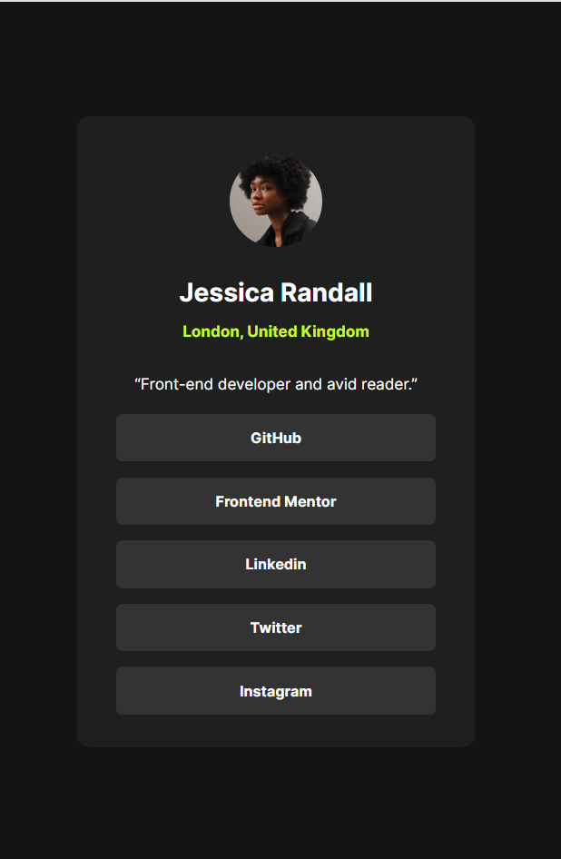

# Frontend Mentor - Social links profile solution

This is a solution to the [Social links profile challenge on Frontend Mentor](https://www.frontendmentor.io/challenges/social-links-profile-UG32l9m6dQ). Frontend Mentor challenges help you improve your coding skills by building realistic projects.

---

## 📑 Table of Contents

- [Overview](#overview)
  - [The Challenge](#the-challenge)
  - [Screenshot](#screenshot)
  - [Links](#links)
- [My Process](#my-process)
  - [Built With](#built-with)
  - [What I Learned](#what-i-learned)
  - [Continued Development](#continued-development)
  - [Useful Resources](#useful-resources)
- [Author](#author)
- [Acknowledgments](#acknowledgments)

---

## 📌 Overview

### 🧩 The Challenge

Users should be able to:

- See hover and focus states for all interactive elements on the page

---

### 📷 Screenshot



---

### 🔗 Links

- 💡 [Solution URL](https://www.frontendmentor.io/solutions/social-links-profile-using-react-js-1NGN3WsV7S)
- 🌐 [Live Site URL](https://social-links-profile-main-ya.netlify.app)

---

## 🔧 My Process

### 🛠️ Built With

- Semantic **HTML5** markup
- **CSS**
- **JavaScript**
- [**React**](https://reactjs.org/) – JS library

---

### 🧠 What I Learned

This was my **first React challenge**. Everything was a learning experience—from setting up the React project to structuring components. You can read documentation all you want, but **practice is what solidifies the knowledge**.

The snippet below shows how I handled hover effects with React `useState`, which I found to be one of the most challenging and educational parts of the project:

```js
const [isHovered, setIsHovered] = useState(null);

const listOfSocials = socials.map(s => (
  <li
    key={s.id}
    onMouseEnter={() => setIsHovered(s.id)}
    onMouseLeave={() => setIsHovered(null)}
    style={{
      backgroundColor: isHovered === s.id ? '#c5f82a' : '#333333',
      color: isHovered === s.id ? 'black' : 'white'
    }}
  >
    {s.social}
  </li>
));
```
---
### 🔄 Continued Development

My current goal is to:

- Keep practicing **React** to gain more confidence in handling state, events, and component logic.
- Improve my **component structure** and **code readability**.
- Learn more about using **React Hooks** effectively.
- Focus on accessibility and semantic HTML to ensure better UX for all users.

---

### 📚 Useful Resources

- [React Documentation](https://react.dev/) – The official documentation is incredibly helpful for both beginners and experienced developers.
- [W3Schools React Tutorial](https://www.w3schools.com/react/) – A simple and quick reference to React fundamentals.
- [Frontend Mentor Discord Community](https://discord.gg/frontendmentor) – A great place to ask questions, get feedback, and connect with other developers.

---

## 👤 Author

- Frontend Mentor – [@yaoamegandjin](https://www.frontendmentor.io/profile/yaoamegandjin)
- GitHub – [@yaoamegandjin](https://github.com/yaoamegandjin)
---

## 🙏 Acknowledgments

Big thanks to:

- **Frontend Mentor** for providing amazing challenges that help developers improve by building real-world projects.
- The **React documentation team** for making the learning experience clear and beginner-friendly.
- Everyone in the **Frontend Mentor Discord community** who shares feedback, support, and inspiration.


