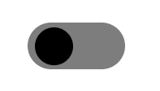
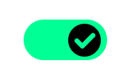

# Advent of CSS - Day 2 🎄  
## CSS-Only Toggle Switch

This project is a solution to the **Advent of CSS Day 2 Challenge**, which focuses on building a **CSS-only toggle component** — no JavaScript involved.

🔗 **Live Site:** [https://css-only-toggle-ya.netlify.app](https://css-only-toggle-ya.netlify.app)

---

## 📋 Challenge Brief

Create a toggle switch UI using only HTML and CSS, mimicking the behavior of a traditional checkbox toggle.

### 🎯 Requirements

- **Unchecked State**
  - Gray background (`#7d7d7d`)
  - Toggle ball aligned to the left
- **Checked State**
  - Green background (`#02ff94`)
  - Toggle ball slides to the right
  - Checkmark SVG appears

---

## 💡 Features

- ✅ Fully functional toggle using only HTML & CSS
- 🎨 Smooth sliding animation between states
- 🔁 Transitions for color and movement
- 📱 Responsive design

---

## 🛠️ Built With

- HTML5
- CSS3
- No JavaScript or external libraries

---

## 🚀 Getting Started

To run this project locally:

1. Clone the repository  
```bash
    git clone https://github.com/your-username/css-only-toggle.git
```
## 📸 Screenshots
### Unchecked State


### Checked State 

